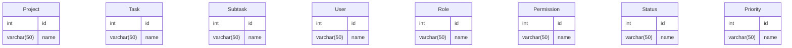

```mermaid
erDiagram
    Project {
        int id
        varchar(50) name
    }

    Task {
        int id
        varchar(50) name
    }

    Subtask {
        int id
        varchar(50) name
    }

    User {
        int id
        varchar(50) name
    }

    Role {
        int id
        varchar(50) name
    }

    Permission {
        int id
        varchar(50) name
    }

    Status {
        int id
        varchar(50) name
    }

    Priority {
        int id
        varchar(50) name
    }

```
