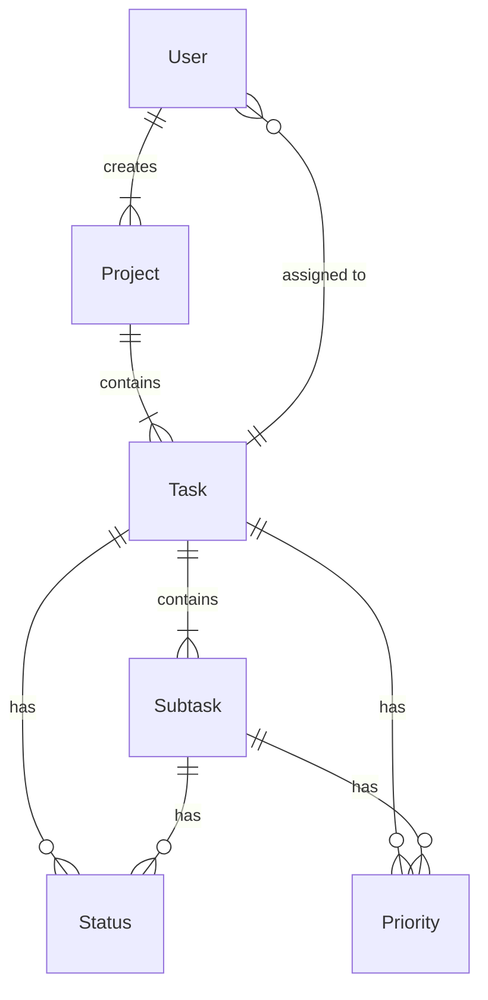

```mermaid
erDiagram
    User ||--|{ Project : "creates"
    Project ||--|{ Task : "contains"
    Task ||--|{ Subtask : "contains"
    Task ||--o{ User : "assigned to"
    Task ||--o{ Status : "has"
    Task ||--o{ Priority : "has"
    Subtask ||--o{ Status : "has"
    Subtask ||--o{ Priority : "has"

```
